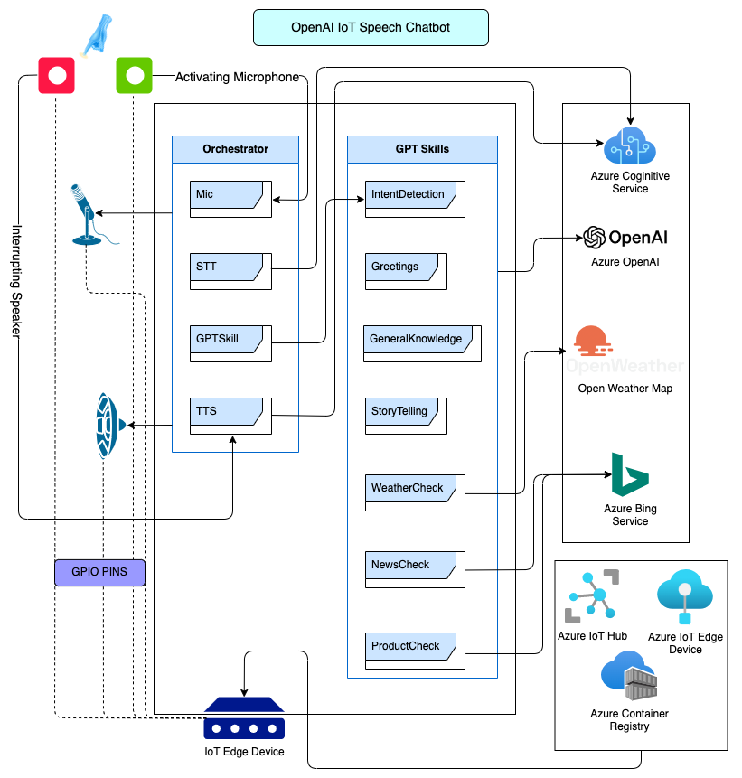
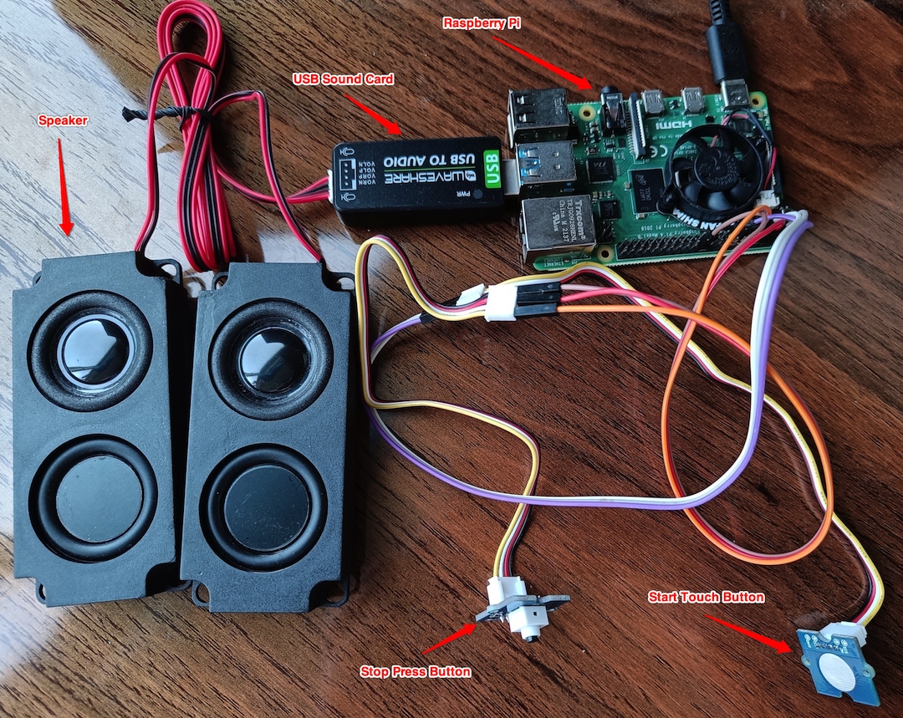

# OpenAI IoT Skill

This project demonstrates how to use OpenAI GPT3.5 model to build your personal assistant in IoT devices. Just like Alexa, Google Assistant, Siri, etc. but with your own skills, custom voice, and custom personality.

You can also name your assistant, currently it is named as `Arya`, means `noble` in Sanskrit.

## Demo

https://github.com/prabdeb/openai-iot-speech-chatbot/assets/37529789/a91fbaf1-c9bf-4e0e-aae2-2de06077bf2a

## Architecture

## Experiments and Evaluation

Developing the OpenAI Prompt is easy with Azure OpenAI Playground, ChatGPT, OpenAI Playground, or even a simple Python script. But, the real challenge is to evaluate the performance of the OpenAI Prompt. There could be again tons of possibilities for evaluation.

In this project, we have used the [Azure ML PromptFlow](https://learn.microsoft.com/en-us/azure/machine-learning/prompt-flow/overview-what-is-prompt-flow?view=azureml-api-2) to perform experiments and evaluate the performance of the OpenAI Prompt. The PromptFlow is a framework for building and evaluating OpenAI Prompt. It is built on top of Azure Machine Learning and Azure OpenAI Services.

Why PromptFlow? Why not? There are several Out of the Box evaluations that PromptFlow provides, few of them are used in this project.

For more details on the experiments and evaluation, please refer to [Experiments and Evaluation](./experiments/README.md).

## Development and Deployment

To get started with this solution follow the documentation as mentioned in [Azure IoT Solution](./azure_iot_solution/README.md).

## Demo Hardware Setup

